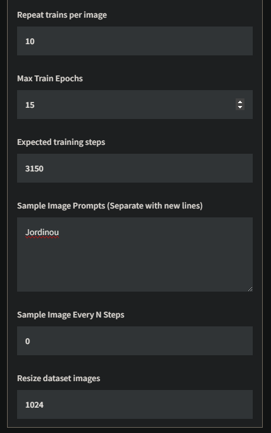

[Flux Gym tutorial on ThinkDiffusion](https://learn.thinkdiffusion.com/make-your-character-style-lora-stand-out-easy-lora-training-with-fluxgym/)

[Flux Krea Trainer](https://fal.ai/models/fal-ai/flux-krea-trainer)

## test Jordinou 19/08/2025 with Flux Gym

The name of your LoRA
This has to be a unique name
Jordinou young 30-year-old French politician

Trigger word/sentence
Trigger word or sentence to be used
Jordinou

20h56 Add AI captions / 20h57

Object LoRAs: For specific items or props
Pose LoRAs: For particular poses or compositions
Modifier LoRAs: For specific effects or modifications

19:13 0%
20:13 40%

689 steps

[2025-08-19 20:18:27] [INFO] epoch 8/15
[2025-08-19 20:18:27] [INFO] 2025-08-19 20:18:27 INFO     epoch is incremented.             train_util.py:715
[2025-08-19 20:18:27] [INFO] current_epoch: 7, epoch: 8
[2025-08-19 20:18:27] [INFO] 2025-08-19 20:18:27 INFO     epoch is incremented.             train_util.py:715
[2025-08-19 20:18:27] [INFO] current_epoch: 7, epoch: 8