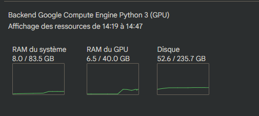

# extraction audio avec stacher

Emmanuel Macron Discours
https://www.youtube.com/watch?v=Dm27NwstXcY


# découpage avec Adobe Audition


# Google Colab Training

## Rappel des processeurs

Processeur (CPU) : calcul général. OK pour pré-traitement, petites tâches, pas pour l’entraînement GPU/TPU.

GPU T4 (NVIDIA, “Turing”) : entrée de gamme. 16 Go de VRAM typiquement. Bien pour inference/finetune légers (petits LLM, diffusion en 512²).

GPU L4 (NVIDIA, “Ada” datacenter) : milieu de gamme récent, orienté inférence et multimédia (NVENC/NVDEC costauds). Plus rapide que T4, VRAM typiquement 24 Go.

GPU A100 (NVIDIA, “Ampere”) : haut de gamme entraînement. Très rapide en FP16/BF16/TF32, beaucoup de VRAM (souvent 40 Go sur Colab). Idéal pour gros batchs, gros modèles.

TPU v5e-1 (Google) : bon rapport perf/€ pour JAX/TF. Très efficace en BF16, mais PyTorch nécessite XLA (moins plug-and-play). “-1” = plus petit slice.

TPU v6e-1 (Google) : génération plus récente que v5e, meilleure perf/efficacité sur JAX/TF. Même remarques côté PyTorch/XLA.

##  Ultimate_rvc_colab.ipynb


### reco chatGPT5

Données : vise ≥ 10–15 min (mieux : 30–60 min) de voix propre, sans musique/bruit.

Avec 20–60 min de données : ~200–400 epochs suffisent généralement (on arrête quand la val loss stagne et que l’overfit apparaît).

Avec 3,7 min (ton cas) : tu peux pousser à 600–1 200 epochs pour “faire sortir un timbre”, mais tu auras vite de l’overfit (robotisation/artefacts) et la qualité restera limitée. Mieux vaut augmenter le dataset que d’augmenter encore les epochs.

### test 01 : A100
Avant entrainement avec A1000 : Disponible : 272.82 unités de calcul
Audio skiping method : Automatic (Skip m'a donné une erreur log-test-01.txt)
Sample rate : 40000
Number of epochs : 500

- start 14h20
- public URL : 14h23
- train : 
  - 14h36 - epoch 0 - 271.56 unités de calculs
  - 14h56  - epoch 240 -  269.57 unités de calcul
  


### test 02 : 

Processeur L4 
Source : 31 fichiers wav 44kz 16 bits / durée totale 1187 secondes = 20'
epoch : 300

epoch 1 : 17:16:24
epoch 100 : 18:01:01


# Exit Google Colab

``` python
    import time, os

    # attendre 2 heures (7200 secondes)
    time.sleep(3600)

    # arrêter le runtime
    os._exit(0)
```