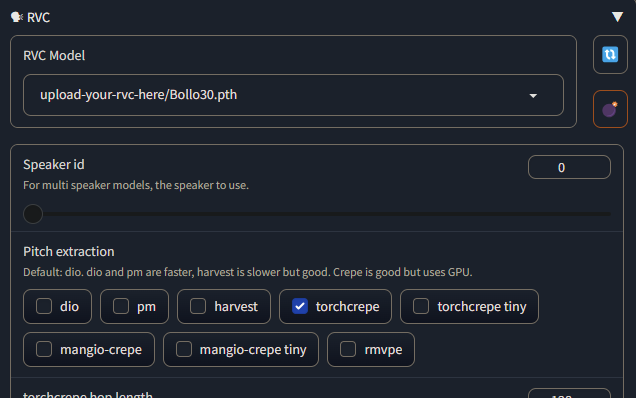

# extraction audio avec stacher

Emmanuel Macron Discours
https://www.youtube.com/watch?v=Dm27NwstXcY

# découpage avec Adobe Audition

# Google Colab Training

https://github.com/JackismyShephard/ultimate-rvc

## Rappel des processeurs

Processeur (CPU) : calcul général. OK pour pré-traitement, petites tâches, pas pour l’entraînement GPU/TPU.

GPU T4 (NVIDIA, “Turing”) : entrée de gamme. 16 Go de VRAM typiquement. Bien pour inference/finetune légers (petits LLM, diffusion en 512²).

GPU L4 (NVIDIA, “Ada” datacenter) : milieu de gamme récent, orienté inférence et multimédia (NVENC/NVDEC costauds). Plus rapide que T4, VRAM typiquement 24 Go.

GPU A100 (NVIDIA, “Ampere”) : haut de gamme entraînement. Très rapide en FP16/BF16/TF32, beaucoup de VRAM (souvent 40 Go sur Colab). Idéal pour gros batchs, gros modèles.

TPU v5e-1 (Google) : bon rapport perf/€ pour JAX/TF. Très efficace en BF16, mais PyTorch nécessite XLA (moins plug-and-play). “-1” = plus petit slice.

TPU v6e-1 (Google) : génération plus récente que v5e, meilleure perf/efficacité sur JAX/TF. Même remarques côté PyTorch/XLA.

##  Ultimate_rvc_colab.ipynb

### reco chatGPT5

Données : vise ≥ 10–15 min (mieux : 30–60 min) de voix propre, sans musique/bruit.

Avec 20–60 min de données : ~200–400 epochs suffisent généralement (on arrête quand la val loss stagne et que l’overfit apparaît).

Avec 3,7 min (ton cas) : tu peux pousser à 600–1 200 epochs pour “faire sortir un timbre”, mais tu auras vite de l’overfit (robotisation/artefacts) et la qualité restera limitée. Mieux vaut augmenter le dataset que d’augmenter encore les epochs.

### Feature Extraction

F0 Method
- mvpe
- crepe
- crepe-tiny

Embedder model
- contentvec
- chinese
- japanese
- corean
- custom

### Options training

- Number of epochs
- Algorithmic

- Vocoder
  - HIFI-GAN
  - MRF HIFI-GAN
  - Refine Gan

- Index algorithm
  - Auto
  - Faiss
  - KMeans
- Pretrained model type
  - Default
  - None
  - Custom

Parfait 👍 tu touches à un point **clé de RVC** : la méthode d’extraction de la **hauteur fondamentale (F0 / pitch)**.
Cette étape est essentielle car elle détermine la justesse et la prosodie de la voix clonée.

Voici les différences :

---

## 🔹 F0 Method

### 1. **mvpe (Multi-view Pitch Estimation)**

* Méthode plus récente et rapide.
* Assez robuste même avec du bruit.
* Bon compromis entre précision et vitesse.
* **Recommandé** si tu veux entraîner vite sans perdre trop de qualité.

---

### 2. **crepe**

* Utilise un modèle neuronal (CREPE) spécialisé dans la détection de pitch.
* **Très précis**, surtout sur des voix claires et bien enregistrées.
* Plus lent que `mvpe` car il calcule frame par frame.
* Idéal si tu cherches **qualité maximale**, au prix d’un temps d’extraction plus long.

---

### 3. **crepe-tiny**

* Version allégée de CREPE.
* Plus rapide mais **moins précis**, parfois instable si l’enregistrement est bruité ou si la voix monte/descend vite.
* Tu peux l’utiliser pour tester ou si tu as beaucoup d’audio.

---

👉 En résumé :

* **mvpe** → rapide, fiable, recommandé par défaut.
* **crepe** → plus lent, mais meilleur rendu si tu veux la précision fine du pitch (souvent meilleur pour chanter).
* **crepe-tiny** → juste si tu veux gagner du temps, mais la qualité peut en souffrir.

## 🔹 1. **Number of epochs**

* Une **epoch** = un passage complet de ton dataset (tous tes fichiers audio) dans le modèle.
* Plus d’epochs → meilleure convergence, mais risque d’**overfitting** (le modèle “mémorise” au lieu de généraliser).
* Typiquement en RVC, avec ~5–10 minutes de voix, on est entre **200–400 epochs** pour un rendu correct.
* Tu peux arrêter avant si la `gen_loss` se stabilise.

---

## 🔹 2. **Algorithmic**

* Ici ça désigne le **méthode de calcul des features d’entraînement** (par ex. extraction de pitch/F0, spectrogrammes, etc.).
* Certains notebooks appellent ça "algorithmic features" ou "algorithmic training".
* En pratique, c’est le choix de la stratégie d’extraction des **caractéristiques acoustiques** de ta voix qui seront ensuite utilisées par le modèle.
* Tu laisses souvent par défaut sauf si tu veux tester un autre pipeline d’extraction.

---

## 🔹 3. **Vocoder**

Le vocoder est la brique qui **reconstruit l’audio final** à partir des features intermédiaires.
Différents vocoders donnent un rendu différent :

* **HiFi-GAN**

  * Le plus classique et rapide.
  * Donne un son propre et naturel dans la majorité des cas.

* **MRF HiFi-GAN** (*Multi-Receptive Field HiFi-GAN*)

  * Variante améliorée qui capte mieux les détails fins (formants, intonations).
  * Légèrement plus lourd mais meilleure qualité.

* **Refine GAN**

  * Étape de "post-traitement" qui raffine le rendu.
  * Peut donner une meilleure clarté sur certaines voix mais plus lent.

👉 En résumé : **HiFi-GAN** pour vitesse, **MRF** pour qualité plus riche, **Refine GAN** si tu veux un rendu plus poli.

---

## 🔹 4. **Index algorithm**

C’est pour construire l’**index de features** utilisé dans la conversion par recherche (retrieval).
Cet index permet de rapprocher la voix cible des segments de ta voix entraînée.

* **Auto**

  * Laisse le système choisir (souvent FAISS).

* **Faiss**

  * Librairie optimisée (Facebook AI Similarity Search).
  * Rapide et efficace pour la recherche de voisins.

* **KMeans**

  * Regroupe les features en clusters.
  * Moins précis mais parfois plus stable si ton dataset est petit.

👉 En général : **FAISS** est le plus utilisé/recommandé.

---

## 🔹 5. **Pretrained model type**

Détermine si tu pars d’un modèle déjà entraîné ou pas.

* **Default**

  * Utilise le modèle pré-entraîné RVC fourni par défaut.
  * C’est la meilleure option si tu n’as que peu de données (il sert de base et apprend juste ta voix).

* **None**

  * Entraîne à partir de zéro, sans pré-apprentissage.
  * Plus long, nécessite beaucoup de données (plusieurs heures de voix).

* **Custom**

  * Tu donnes ton propre modèle de départ (par ex. un autre `.pth` que tu as déjà).
  * Utile si tu veux affiner un modèle existant ou entraîner une variante.

---

👉 Donc, en résumé, les réglages conseillés pour un premier essai avec tes **8 minutes 22 secondes de dataset** :

* **Epochs** : 250–400
* **Algorithmic** : Default (ne touche pas si tu ne sais pas)
* **Vocoder** : HiFi-GAN ou MRF HiFi-GAN si tu veux plus de détails
* **Index algorithm** : FAISS
* **Pretrained model type** : Default

## Output

.pth = poids du modèle (obligatoire).

.index = index de features (optionnel mais recommandé : meilleure stabilité/timbre quand tu règles un “index rate” > 0).

