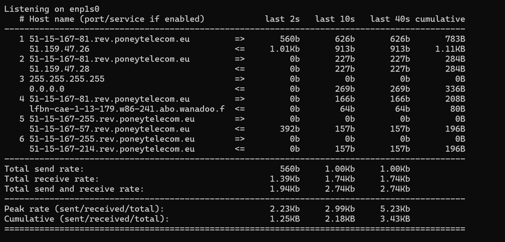
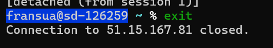

git clone https://github.com/danielmiessler/SecLists/

du -sh directory
ls -lh
head filename

tmux ctrl+b + " / % / [ q / x y 

sudo iftop -i enp1s0

Tu veux aller plus loin ?

Voir les ports utilisés pour savoir quel service est ciblé ?

Lancer un tcpdump pour inspecter les paquets ?

Bloquer certains IPs avec ufw ou iptables ?

iptraf: Deep Dive into Network Traffic

https://www.secopsolution.com/blog/monitoring-your-network-iftop-vs-iptraf-vs-nload

