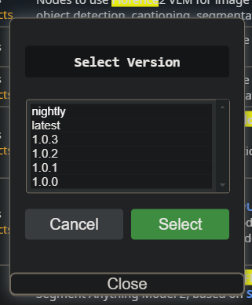
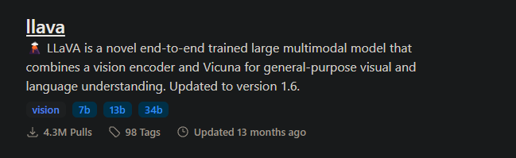
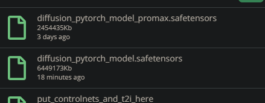
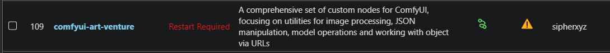
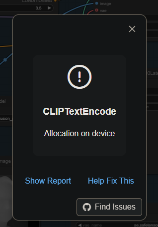

## Ep07 - Working With Text - Art Styles Update

For custom node "was-node-suite-comfyui" I am trying to setup "webui_styles" parameter in the "was_suite_config.json" file to fit my "mystyles.csv", but this doesn't work : "webui_styles": "/home/ubuntu/ComfyUI/custom_nodes/was-node-suite-comfyui/mystyles.csv"

../user_data/comfyui/custom_nodes/was-node-suite-comfyui/was_suite_config.json

    {
        "run_requirements": true,
        "suppress_uncomfy_warnings": true,  
        "show_startup_junk": true,
        "show_inspiration_quote": true,
        "text_nodes_type": "STRING",
        "webui_styles": "/home/ubuntu/ComfyUI/models/styles/styles_-_styles.csv",
        "webui_styles_persistent_update": true,
        "sam_model_vith_url": "https://dl.fbaipublicfiles.com/segment_anything/sam_vit_h_4b8939.pth",
        "sam_model_vitl_url": "https://dl.fbaipublicfiles.com/segment_anything/sam_vit_l_0b3195.pth",
        "sam_model_vitb_url": "https://dl.fbaipublicfiles.com/segment_anything/sam_vit_b_01ec64.pth",
        "history_display_limit": 36,
        "use_legacy_ascii_text": false,
        "ffmpeg_bin_path": "/path/to/ffmpeg",
        "ffmpeg_extra_codecs": {
        "avc1": ".mp4",
        "h264": ".mkv"
        },
        "wildcards_path": "/home/ubuntu/ComfyUI/custom_nodes/was-node-suite-comfyui/wildcards",
        "wildcard_api": true
    }

  replace with 

      "webui_styles": "/home/ubuntu/ComfyUI/models/styles/styles_-_styles.csv",

## [Ep09 - How to Use SDXL ControlNet Union](https://www.youtube.com/watch?v=C0zykaDF1ts)

https://huggingface.co/xinsir/controlnet-union-sdxl-1.0/tree/main

../user_data/comfyui/models/controlnet/diffusion_pytorch_model_promax.safetensors

Install custom nodes :
- comfyui-art-venture
- ComfyUI's ControlNet Auxiliary Preprocessors
- Comfyroll Studio (to stack multiple controlnet)

## [Ep10 - Flux GGUF and Custom Nodes](https://www.youtube.com/watch?v=Ym0oJpRbj4U)

Install custom nodes :
- comfyui-gguf
- crystools
- rgthree's ComfyUI Nodes

https://huggingface.co/city96/FLUX.1-dev-gguf/tree/main
https://huggingface.co/city96/FLUX.1-dev-gguf/blob/main/flux1-dev-Q8_0.gguf

copy in : ../user_data/comfyui/models/unet

Get clip_l.safetensors from here
https://huggingface.co/comfyanonymous/flux_text_encoders/tree/main
Place it in the clip folder ..ComfyUI\models\clip

Get one of the T5 encoders (recommended to use Q5_K_M or larger for the best results)
https://huggingface.co/city96/t5-v1_1-xxl-encoder-gguf/tree/main
Place it in the clip folder ..ComfyUI\models\clip

Get the ae.safetensor vae from here
https://huggingface.co/black-forest-labs/FLUX.1-schnell/blob/main/ae.safetensors
Place it in the vae folder ..ComfyUI\models\vae

## ThinkDiffusion Competitors 

https://comfy.icu/

[custome Nodes](https://comfy.icu/node/)

## [Ep11 - LLM, Prompt Generation, img2txt, txt2txt Overview](https://www.youtube.com/watch?v=yutYU97Bj7E)

### Florence 
Install Florence

I use the latest

DownloadAndLoadFlorence2Model -> automatic in ../user_data/comfyui/models/LLM/Florence-2-base

### Searge

Instal custom nodes : Searge-LLM for ComfyUI v1.0

create directory : models/llm_gguf

place Mistral-7B-Instruct-v0.3.Q4_K_M.gguf in the ComfyUI/models/llm_gguf directory.

https://huggingface.co/MaziyarPanahi/Mistral-7B-Instruct-v0.3-GGUF/tree/main
Recommended : https://huggingface.co/MaziyarPanahi/Mistral-7B-Instruct-v0.3-GGUF/resolve/main/Mistral-7B-Instruct-v0.3.Q4_K_M.gguf

## [Ep12 - How to Upscale Your AI Images](https://www.youtube.com/watch?v=i8v9RbNy4Zw)

Go to manger, model manager / sort by type Upscale : 
- 4x_NMKD-Siax_200k
- 4x-AnimeSharp
- 4x_foolhardy_Remacri

Refresh ComfyUI

Install this custom nodes :
- ControlAltAI Nodes
- ComfyUI-PixelResolutionCalculator
- ComfyUI Easy Use
- rgthree's ComfyUI Nodes

Restart ComfyUI

## [Ep13 - Exploring Ollama, LLaVA, Gemma Models](https://www.youtube.com/watch?v=eK6MXm7q37c)

Link pixorama workflows : https://discord.com/channels/1245221993746399232/1323521185132183694

[Ollama search](https://ollama.com/search)

Install these custom nodes :

- ComfyUI Ollama created by stavsap
- ComfyUI Easy Use

## [Ep14 - How to Use Flux ControlNet Union Pro](https://www.youtube.com/watch?v=WHuhxKk40k4)

https://discord.com/channels/1245221993746399232/1323578980581904488

### New model

[model diffusion_pytorch_model.safetensors](https://huggingface.co/Shakker-Labs/FLUX.1-dev-ControlNet-Union-Pro/tree/main)

How to change name inside of models inside controlnet ? 

### Custom nodes

ComfyUI's ControlNet Auxiliary Preprocessors

conflict with : 

Uninstall ComfyUI's ControlNet Auxiliary Preprocessors

### Allocation on device

## [Ep15 - Styles Update, Prompts](https://www.youtube.com/watch?v=KMlUakdbdnc)
https://discord.com/channels/1245221993746399232/1323585163896033380

### Custom nodes

ComfyUI-iTools