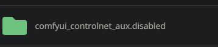
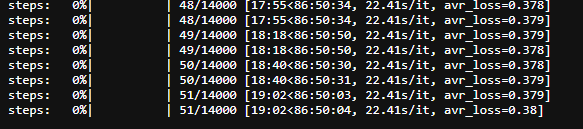

- [Ep07 - Working With Text - Art Styles Update](#ep07---working-with-text---art-styles-update)
- [Ep09 - How to Use SDXL ControlNet Union](#ep09---how-to-use-sdxl-controlnet-union)
- [Ep10 - Flux GGUF and Custom Nodes](#ep10---flux-gguf-and-custom-nodes)
- [ThinkDiffusion Competitors](#thinkdiffusion-competitors)
- [Ep11 - LLM, Prompt Generation, img2txt, txt2txt Overview](#ep11---llm-prompt-generation-img2txt-txt2txt-overview)
  - [Florence](#florence)
  - [Searge](#searge)
- [Ep12 - How to Upscale Your AI Images](#ep12---how-to-upscale-your-ai-images)
- [Ep13 - Exploring Ollama, LLaVA, Gemma Models](#ep13---exploring-ollama-llava-gemma-models)
- [Ep14 - How to Use Flux ControlNet Union Pro](#ep14---how-to-use-flux-controlnet-union-pro)
  - [New model](#new-model)
  - [Custom nodes](#custom-nodes)
  - [Allocation on device](#allocation-on-device)
  - [Not working with BAE](#not-working-with-bae)
- [Ep15 - Styles Update, Prompts](#ep15---styles-update-prompts)
  - [Custom nodes](#custom-nodes-1)
- [Ep17 Flux LoRA ](#ep17-flux-lora-)
  - [Some Lora](#some-lora)
  - [from civitai](#from-civitai)
  - [Custom Nodes](#custom-nodes-2)
- [Flux LoRA Training with Kohya in 2025](#flux-lora-training-with-kohya-in-2025)
  - [Version Kohya v24.1.7 (sep 6,2024)](#version-kohya-v2417-sep-62024)
  - [Uploading images](#uploading-images)
  - [Blip Captioning](#blip-captioning)
  - [Dataset preparation](#dataset-preparation)
    - [Test 1](#test-1)
    - [Test 2](#test-2)
  - [Glossary \& concept for Kohya](#glossary--concept-for-kohya)


## Ep07 - Working With Text - Art Styles Update

For custom node "was-node-suite-comfyui" I am trying to setup "webui_styles" parameter in the "was_suite_config.json" file to fit my "mystyles.csv", but this doesn't work : "webui_styles": "/home/ubuntu/ComfyUI/custom_nodes/was-node-suite-comfyui/mystyles.csv"


../user_data/comfyui/custom_nodes/was-node-suite-comfyui/was_suite_config.json

    {
        "run_requirements": true,
        "suppress_uncomfy_warnings": true,  
        "show_startup_junk": true,
        "show_inspiration_quote": true,
        "text_nodes_type": "STRING",
        "webui_styles": "/home/ubuntu/ComfyUI/models/styles/styles_-_styles.csv",
        "webui_styles_persistent_update": true,
        "sam_model_vith_url": "https://dl.fbaipublicfiles.com/segment_anything/sam_vit_h_4b8939.pth",
        "sam_model_vitl_url": "https://dl.fbaipublicfiles.com/segment_anything/sam_vit_l_0b3195.pth",
        "sam_model_vitb_url": "https://dl.fbaipublicfiles.com/segment_anything/sam_vit_b_01ec64.pth",
        "history_display_limit": 36,
        "use_legacy_ascii_text": false,
        "ffmpeg_bin_path": "/path/to/ffmpeg",
        "ffmpeg_extra_codecs": {
        "avc1": ".mp4",
        "h264": ".mkv"
        },
        "wildcards_path": "/home/ubuntu/ComfyUI/custom_nodes/was-node-suite-comfyui/wildcards",
        "wildcard_api": true
    }


  replace with 

      "webui_styles": "/home/ubuntu/ComfyUI/models/styles/styles_-_styles.csv",

## [Ep09 - How to Use SDXL ControlNet Union](https://www.youtube.com/watch?v=C0zykaDF1ts)

https://huggingface.co/xinsir/controlnet-union-sdxl-1.0/tree/main

../user_data/comfyui/models/controlnet/diffusion_pytorch_model_promax.safetensors

Install custom nodes :
- comfyui-art-venture
- ComfyUI's ControlNet Auxiliary Preprocessors
- Comfyroll Studio (to stack multiple controlnet)


## [Ep10 - Flux GGUF and Custom Nodes](https://www.youtube.com/watch?v=Ym0oJpRbj4U)

Install custom nodes :
- comfyui-gguf
- crystools
- rgthree's ComfyUI Nodes

https://huggingface.co/city96/FLUX.1-dev-gguf/tree/main
https://huggingface.co/city96/FLUX.1-dev-gguf/blob/main/flux1-dev-Q8_0.gguf

copy in : ../user_data/comfyui/models/unet

Get clip_l.safetensors from here
https://huggingface.co/comfyanonymous/flux_text_encoders/tree/main
Place it in the clip folder ..ComfyUI\models\clip

Get one of the T5 encoders (recommended to use Q5_K_M or larger for the best results)
https://huggingface.co/city96/t5-v1_1-xxl-encoder-gguf/tree/main
Place it in the clip folder ..ComfyUI\models\clip

Get the ae.safetensor vae from here
https://huggingface.co/black-forest-labs/FLUX.1-schnell/blob/main/ae.safetensors
Place it in the vae folder ..ComfyUI\models\vae

## ThinkDiffusion Competitors 

https://comfy.icu/

[custome Nodes](https://comfy.icu/node/)

## [Ep11 - LLM, Prompt Generation, img2txt, txt2txt Overview](https://www.youtube.com/watch?v=yutYU97Bj7E)

### Florence 
Install Florence


I use the latest

DownloadAndLoadFlorence2Model -> automatic in ../user_data/comfyui/models/LLM/Florence-2-base

### Searge

Instal custom nodes : Searge-LLM for ComfyUI v1.0

create directory : models/llm_gguf

place Mistral-7B-Instruct-v0.3.Q4_K_M.gguf in the ComfyUI/models/llm_gguf directory.

https://huggingface.co/MaziyarPanahi/Mistral-7B-Instruct-v0.3-GGUF/tree/main
Recommended : https://huggingface.co/MaziyarPanahi/Mistral-7B-Instruct-v0.3-GGUF/resolve/main/Mistral-7B-Instruct-v0.3.Q4_K_M.gguf

## [Ep12 - How to Upscale Your AI Images](https://www.youtube.com/watch?v=i8v9RbNy4Zw)

Go to manger, model manager / sort by type Upscale : 
- 4x_NMKD-Siax_200k
- 4x-AnimeSharp
- 4x_foolhardy_Remacri

Refresh ComfyUI

Install this custom nodes :
- ControlAltAI Nodes
- ComfyUI-PixelResolutionCalculator
- ComfyUI Easy Use
- rgthree's ComfyUI Nodes

Restart ComfyUI

## [Ep13 - Exploring Ollama, LLaVA, Gemma Models](https://www.youtube.com/watch?v=eK6MXm7q37c)

Link pixorama workflows : https://discord.com/channels/1245221993746399232/1323521185132183694


[Ollama search](https://ollama.com/search)


Install these custom nodes :

- ComfyUI Ollama created by stavsap
- ComfyUI Easy Use

## [Ep14 - How to Use Flux ControlNet Union Pro](https://www.youtube.com/watch?v=WHuhxKk40k4)

https://discord.com/channels/1245221993746399232/1323578980581904488

### New model

[model diffusion_pytorch_model.safetensors](https://huggingface.co/Shakker-Labs/FLUX.1-dev-ControlNet-Union-Pro/tree/main)


How to change name inside of models inside controlnet ? 


### Custom nodes


ComfyUI's ControlNet Auxiliary Preprocessors




conflict with : 


Uninstall ComfyUI's ControlNet Auxiliary Preprocessors

ThinkDiff Team Advice


https://huggingface.co/Shakker-Labs/FLUX.1-dev-ControlNet-Union-Pro
https://huggingface.co/Shakker-Labs/FLUX.1-dev-ControlNet-Union-Pro/resolve/main/diffusion_pytorch_model.safetensors

### Allocation on device


### Not working with BAE

## [Ep15 - Styles Update, Prompts](https://www.youtube.com/watch?v=KMlUakdbdnc)
https://discord.com/channels/1245221993746399232/1323585163896033380

### Custom nodes

ComfyUI-iTools

 ## [Ep17 Flux LoRA ](https://www.youtube.com/watch?v=-aW1U8QEak0&t=234s)

### Some Lora

Download flux-ghibsky-illustration lora
https://huggingface.co/aleksa-codes/flux-ghibsky-illustration/tree/main
Place it in the loras folder ..ComfyUI\models\loras
Trigger Word: GHIBSKY

Download 70s SciFi Style
https://civitai.com/models/824478/70s-scifi-style-by-chronoknight-flux
Place it in the loras folder ..ComfyUI\models\loras
Trigger Word: ck-70scf

Download Flux Fantasy Lora
https://www.shakker.ai/modelinfo/3cf25bb29e0144e4849064b122150054/Flux-Fantasy-Hide?from=models
Place it in the loras folder ..ComfyUI\models\loras
Trigger Word: fantasy
Recommended weight 0.8

Download Sketchy Pastel Anime Flux Lora
https://www.shakker.ai/modelinfo/33815c53e3024899bde957fa012e1f43/TQ-Sketchy-Pastel-Anime-Flux?from=models
Place it in the loras folder ..ComfyUI\models\loras
Trigger Word: anime
Recommended weight 0.8

Download Flux_Sticker_Lora
https://huggingface.co/diabolic6045/Flux_Sticker_Lora
Place it in the loras folder ..ComfyUI\models\loras
Trigger Word: 5t1cker 5ty1e

Download UltraRealistic Lora
https://civitai.com/models/796382?modelVersionId=940466
Place it in the loras folder ..ComfyUI\models\loras
Trigger Words: amateurish photo
Guidance =2.5 Steps=40

Download diffusion_pytorch_model.safetensors
https://huggingface.co/alimama-creative/FLUX.1-Turbo-Alpha/tree/main
rename it to FLUX.1-Turbo-Alpha or any other name you want
Place it in the loras folder ..ComfyUI\models\loras
guidance_scale=3.5 and lora_scale=1 steps=8

### from civitai
Trigger Words: made out of clouds
Guidance =2.5 Steps=40

STRENGTH: 1
https://civitai.com/models/749668/flux-cloudstyle


### Custom Nodes


## [Flux LoRA Training with Kohya in 2025](https://learn.thinkdiffusion.com/flux-lora-training-with-kohya/)

### Version Kohya v24.1.7 (sep 6,2024)


### Uploading images

/home/ubuntu/user_data/kohya/image/Trump


### Blip Captioning

(done for trump)

### Dataset preparation

Go to Lora / Training / Dataset preparation


1. Dreambooth/LoRA Folder preparation enter :
   - the Instance prompt : trumpuni
   - Class prompt : 
2. Set required paths
   - Training Images: /home/ubuntu/user_data/kohya/image/trump
   - Destination directory : /home/ubuntu/user_data/kohya/output/trump
   - 
3. Set the number of repeats : 20   
4. Click on Prepare training data 
5. Click on Copy info to respective fields.
    - new folder in output/img 
6. Upload config file
    - 
    - /home/ubuntu/user_data/kohya/configs/kohya48gbvram.json
7. Configuration tab
   - 
   - 
8. Start training
   - 
9. Check progress
    - /home/ubuntu/user_data/kohya/logs/francoisbonnard-clipskip-30090550-logs.txt
10. Result
    -  .safetensors files
  
11. TensorBoard
    - Start tensorboard 
    - Open tensorboard 

#### Test 1
    - 11h39 
    - 
    - Steps max 14000 
    -
    -

#### Test 2
    - New test with this parameter :
        "train_batch_size": 2,
        "epoch": 20,
        "save_every_n_epochs": 1,
    - Steps max 4200 

    - TensorBoard in blue 

### Glossary & concept for Kohya

  1. Train Batch Size: As we are using ThinkDiffusion we can set the batch size to 2, but if you are on a lower end GPU, then you should leave this as 1. The batch size determines how many images the model processes simultaneously. The higher the batch size the faster the training will be but it will be more demanding on your GPU. Please note that you can sometimes have an out of memory error when setting the batch size to 2. If you encounter this, you should lower the batch size to 1
  2. Epochs: You can experiment with this figure but as a rule the higher the number of Epochs, the more chance of overtraining the model. Epoch's represent a cycle of training. We selected 20 Epochs in our settings, so this will result in 2 safetensors files at the end of the training. The 1st will be 50% of the training, the 2nd will be 100% of the training. You can experiment which LoRA turned out the best.
  3. Steps: This number is not selected directly but comes as a result of some of your settings. Steps are calculated by the number of images x the number of repeats x the number of Epoch's For example, in this tutorial we had 23 images, 5 repeats and 5 epochs, resulting in 575 steps. I usually try to end up at around 2k - 3k steps when training a LoRA.
  4. Save every n Epoch's: This is useful to see if you are undertraining or overtraining your LoRA. If we are running 5 Epoch's and we save every 1 Epoch then a LoRA will be created at the end of each Epoch. In essence, we will have 5 LoRA's that are created at the end of each Epoch cycle
  5. Caption Extension: Use the '.txt' extension for your captions. This is necessary as Kohya now requires captioned images to avoid warnings.
  6. Mixed Precision: Set your training precision to 'bf16'. bf16 precision is more demanding on your Vram, and it can speed up machine learning algorithms.
  7. Save Precision: Use 'bf16' for saving model checkpoints, with the same considerations as for Mixed Precision mentioned above.
  8. Learning Rate: Set to between 0.0001 and 0.0003 - Typically, the higher the learning rate, the sooner you will finish training the LoRA
  9.  Enable Buckets: Keep this option checked, especially if your images vary in size. This is a very useful feature in Kohya that means we can have different resolutions of images and there is no need to crop them. Essentially Kohya will drop your images into separate buckets of the same sizes. (However, you do not know how Kohya will crop the images, so I prefer to crop my images manually as mentioned in the guide)
  10. Network Rank: This parameter influences the AI's expressiveness. A higher value allows for more creativity. This can typically be set between 16 to 256 as a rule of thumb. The higher the network rank, the bigger the file size of the LoRA will be. However, a larger network rank will also help the LoRA retain more details to improve the quality of the images
  11. Network Alpha: Set Network Alpha to approximately half of the Network Rank value. This parameter acts as a creativity regulator.
  12. Repeats: This is essentially the number of times each image in your dataset is cycled over. Increasing the number of repeats will increase the number of steps and therefore the overall training time.

```json
    "LoRA_type": "Flux1",
        "LyCORIS_preset": "full",
        "adaptive_noise_scale": 0,
        "additional_parameters": "",
        "ae": "/home/ubuntu/kohya_ss/models/ae.safetensors",
        "apply_t5_attn_mask": true,
        "async_upload": false,
        "block_alphas": "",
        "block_dims": "",
        "block_lr_zero_threshold": "",
        "bucket_no_upscale": true,
        "bucket_reso_steps": 64,
        "bypass_mode": false,
        "cache_latents": true,
        "cache_latents_to_disk": true,
        "caption_dropout_every_n_epochs": 0,
        "caption_dropout_rate": 0,
        "caption_extension": ".txt",
        "clip_l": "/home/ubuntu/kohya_ss/models/clip_l.safetensors",
        "clip_skip": 1,
        "color_aug": false,
        "constrain": 0,
        "conv_alpha": 1,
        "conv_block_alphas": "",
        "conv_block_dims": "",
        "conv_dim": 1,
        "cpu_offload_checkpointing": false,
        "dataset_config": "",
        "debiased_estimation_loss": false,
        "decompose_both": false,
        "dim_from_weights": false,
        "discrete_flow_shift": 3,
        "dora_wd": false,
        "down_lr_weight": "",
        "dynamo_backend": "no",
        "dynamo_mode": "default",
        "dynamo_use_dynamic": false,
        "dynamo_use_fullgraph": false,
        "enable_all_linear": false,
        "enable_bucket": true,
        "epoch": 200,
        "extra_accelerate_launch_args": "",
        "factor": -1,
        "flip_aug": false,
        "flux1_cache_text_encoder_outputs": true,
        "flux1_cache_text_encoder_outputs_to_disk": true,
        "flux1_checkbox": true,
        "fp8_base": true,
        "fp8_base_unet": false,
        "full_bf16": true,
        "full_fp16": false,
        "gpu_ids": "",
        "gradient_accumulation_steps": 1,
        "gradient_checkpointing": true,
        "guidance_scale": 1,
        "highvram": false,
        "huber_c": 0.1,
        "huber_schedule": "snr",
        "huggingface_path_in_repo": "",
        "huggingface_repo_id": "",
        "huggingface_repo_type": "",
        "huggingface_repo_visibility": "",
        "huggingface_token": "",
        "img_attn_dim": "",
        "img_mlp_dim": "",
        "img_mod_dim": "",
        "in_dims": "",
        "ip_noise_gamma": 0,
        "ip_noise_gamma_random_strength": false,
        "keep_tokens": 0,
        "learning_rate": 0.0003,
        "log_config": false,
        "log_tracker_config": "",
        "log_tracker_name": "",
        "log_with": "",
        "logging_dir": "/home/ubuntu/user_data/kohya/output/log",
        "loraplus_lr_ratio": 0,
        "loraplus_text_encoder_lr_ratio": 0,
        "loraplus_unet_lr_ratio": 0,
        "loss_type": "l2",
        "lowvram": false,
        "lr_scheduler": "constant",
        "lr_scheduler_args": "",
        "lr_scheduler_num_cycles": 1,
        "lr_scheduler_power": 1,
        "lr_scheduler_type": "",
        "lr_warmup": 0,
        "lr_warmup_steps": 0,
        "main_process_port": 0,
        "masked_loss": false,
        "max_bucket_reso": 2048,
        "max_data_loader_n_workers": 0,
        "max_grad_norm": 1,
        "max_resolution": "1024,1024",
        "max_timestep": 1000,
        "max_token_length": 75,
        "max_train_epochs": 0,
        "max_train_steps": 0,
        "mem_eff_attn": false,
        "mem_eff_save": false,
        "metadata_author": "",
        "metadata_description": "",
        "metadata_license": "",
        "metadata_tags": "",
        "metadata_title": "",
        "mid_lr_weight": "",
        "min_bucket_reso": 256,
        "min_snr_gamma": 7,
        "min_timestep": 0,
        "mixed_precision": "bf16",
        "model_list": "custom",
        "model_prediction_type": "raw",
        "module_dropout": 0,
        "multi_gpu": false,
        "multires_noise_discount": 0.3,
        "multires_noise_iterations": 0,
        "network_alpha": 1,
        "network_dim": 8,
        "network_dropout": 0,
        "network_weights": "",
        "noise_offset": 0.05,
        "noise_offset_random_strength": false,
        "noise_offset_type": "Original",
        "num_cpu_threads_per_process": 2,
        "num_machines": 1,
        "num_processes": 1,
        "optimizer": "AdamW8bit",
        "optimizer_args": "",
        "output_dir": "/home/ubuntu/user_data/kohya/output/model",
        "output_name": "TD_Flux_Model_name",
        "persistent_data_loader_workers": false,
        "pretrained_model_name_or_path": "/home/ubuntu/kohya_ss/models/flux1-dev.safetensors",
        "prior_loss_weight": 1,
        "random_crop": false,
        "rank_dropout": 0,
        "rank_dropout_scale": false,
        "reg_data_dir": "",
        "rescaled": false,
        "resume": "",
        "resume_from_huggingface": "",
        "sample_every_n_epochs": 0,
        "sample_every_n_steps": 200,
        "sample_prompts": "Dreamlike landscape, flowing threads of light, sculpted by wind, textured clay forms, shifting sands, vibrant earth tones, crystalline growths, organic chaos, luminous abstraction, cosmic energy --w 832 --h 1216 --s 20 --l 4 --d 42",
        "sample_sampler": "euler",
        "save_as_bool": false,
        "save_every_n_epochs": 20,
        "save_every_n_steps": 200,
        "save_last_n_epochs": 0,
        "save_last_n_epochs_state": 0,
        "save_last_n_steps": 0,
        "save_last_n_steps_state": 0,
        "save_model_as": "safetensors",
        "save_precision": "bf16",
        "save_state": false,
        "save_state_on_train_end": false,
        "save_state_to_huggingface": false,
        "scale_v_pred_loss_like_noise_pred": false,
        "scale_weight_norms": 0,
        "sdxl": false,
        "sdxl_cache_text_encoder_outputs": true,
        "sdxl_no_half_vae": true,
        "seed": 42,
        "shuffle_caption": false,
        "single_dim": "",
        "single_mod_dim": "",
        "skip_cache_check": false,
        "split_mode": false,
        "split_qkv": false,
        "stop_text_encoder_training": 0,
        "t5xxl": "/home/ubuntu/kohya_ss/models/t5xxl_fp8_e4m3fn.safetensors",
        "t5xxl_lr": 0,
        "t5xxl_max_token_length": 512,
        "text_encoder_lr": 0,
        "timestep_sampling": "sigmoid",
        "train_batch_size": 6,
        "train_blocks": "all",
        "train_data_dir": "/home/ubuntu/user_data/kohya/output/img",
        "train_double_block_indices": "all",
        "train_norm": false,
        "train_on_input": true,
        "train_single_block_indices": "all",
        "train_t5xxl": false,
        "training_comment": "",
        "txt_attn_dim": "",
        "txt_mlp_dim": "",
        "txt_mod_dim": "",
        "unet_lr": 0.0001,
        "unit": 1,
        "up_lr_weight": "",
        "use_cp": false,
        "use_scalar": false,
        "use_tucker": false,
        "v2": false,
        "v_parameterization": false,
        "v_pred_like_loss": 0,
        "vae": "",
        "vae_batch_size": 0,
        "wandb_api_key": "",
        "wandb_run_name": "",
        "weighted_captions": false,
        "xformers": "sdpa"
```